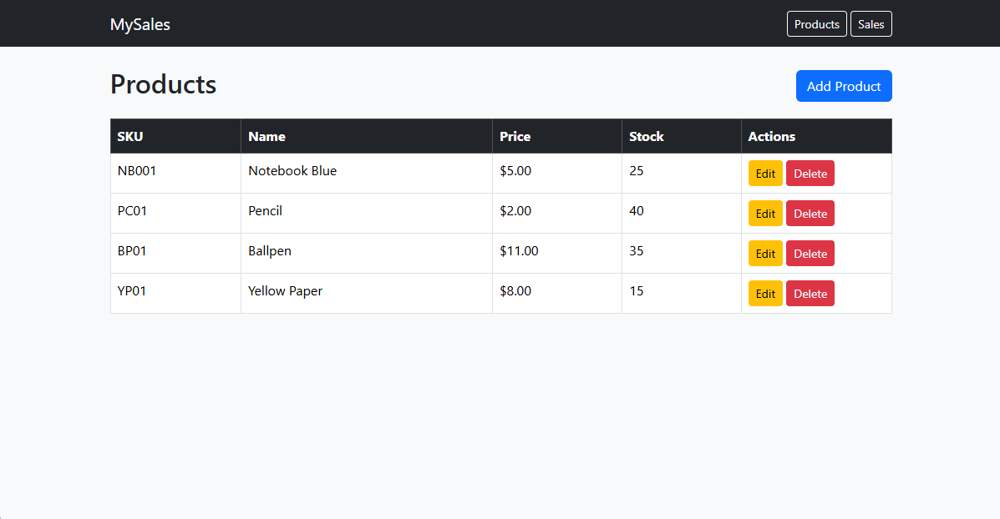
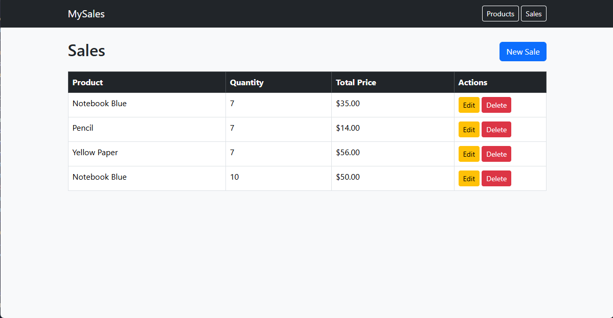

# 🛒 mySales - Laravel Transaction Processing System (Midterm Project)

## 📘 Description / Overview
**mySales** is a web-based **Transaction Processing System (TPS)** built with the **Laravel framework**.  
It manages products and sales transactions, allowing users to record, monitor, and update sales efficiently.  
This project demonstrates the use of **Laravel MVC**, **Eloquent ORM relationships**, and **CRUD operations** for real-world business data management.

---

## 🎯 Objectives
- To apply the **Laravel MVC architecture** in developing a working transaction system.  
- To implement **CRUD (Create, Read, Update, Delete)** operations for both products and sales.  
- To demonstrate **one-to-many relationships** between products and sales using **Eloquent ORM**.  
- To build an organized system using **Blade templates** and structured Laravel routing.  
- To gain hands-on experience deploying and documenting a Laravel project.

---

## ⚙️ Features / Functionality

### 🧾 Product Management
- Add, view, edit, and delete product entries.  
- Each product contains:
  - Name  
  - SKU (Stock Keeping Unit)  
  - Price  
  - Stock Quantity  

### 💵 Sales Management
- Record new sales linked to specific products.  
- View, edit, or delete sales records.  
- Product stock automatically decreases after a sale is recorded.

### 🔗 Eloquent Relationships
- One Product → Many Sales  
  ```php
  // Product.php
  public function sales() {
      return $this->hasMany(Sale::class);
  }

  // Sale.php
  public function product() {
      return $this->belongsTo(Product::class);
  }

---

## ⚙️ Installation Instructions

### Prerequisites
- PHP >= 8.1
- Composer
- MySQL
- Node.js & NPM (optional for asset compilation)
- Git

### STEPS

1. **Clone the repository**
    git clone https://github.com/BenjieHufana/GitHub-Collaboration.git
2. **Navigate into the project**
    cd mySales
3. **Install dependencies**
    composer install
    npm install
4. **Copy and set up your environment file**
    cp .env.example .env
5. **Generate an application key**
    php artisan key:generate
6. **Set up your database in .env**
    DB_DATABASE=mysales_db
    DB_USERNAME=root
    DB_PASSWORD=
7. **Run migrations and seed the data**
    php artisan migrate --seed
8. **Start the Laravel development server**
    php artisan serve
9. **Access the system**
    http://127.0.0.1:8000

---

🧠 Usage
1. From the home page, click **“Products”** to view all available products.
2. Use **“Add Product”** to register a new product.
3. Navigate to **“Sales”** to record a new sale.
4. Edit or delete existing records as needed.
5. Observe automatic stock updates when sales are recorded.

---

🖼️ Screenshots or Code Snippets

🧾 Products Page


💵 Sales Page


---

Sample Controller Logic
// SaleController.php
public function store(Request $request)
{
    $sale = Sale::create($request->all());
    $product = Product::find($request->product_id);
    $product->decrement('stock', $request->quantity);
    return redirect()->route('sales.index');
}

---

Contributors
Name: **Benjie Hufana** 
- BS InfoTech 4B - DMMMSU - MLUC [College of Information Technology]

---

📜 License
**This project is for educational purposes only and is not licensed for commercial use.**
